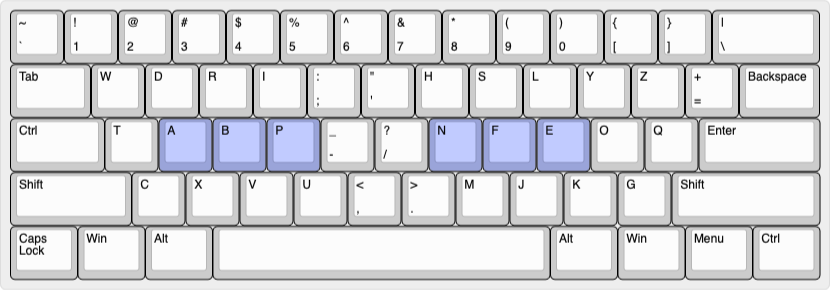

# Symmacs: An Ergonomic Keyboard Layout for GNU Emacs Enthusiasts

# Design Philosophy
I have a profound appreciation for symmetries, and this love for
balance is beautifully reflected in the world of GNU Emacs through its
numerous paired commands, such as `forward/backward-` and
`next/previous-`.  The Symmacs keyboard layout has been meticulously
crafted to mirror these frequently used keys for opposing commands in
a symmetrical manner.  Additionally, I have taken into account letter
frequencies, bigrams, and trigrams to ensure an optimized experience
for your GNU Emacs journey.

My hope is that Symmacs will enhance your overall GNU Emacs experience
and make your interactions with this powerful text editor even more
seamless and enjoyable.
